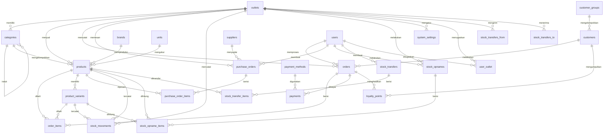
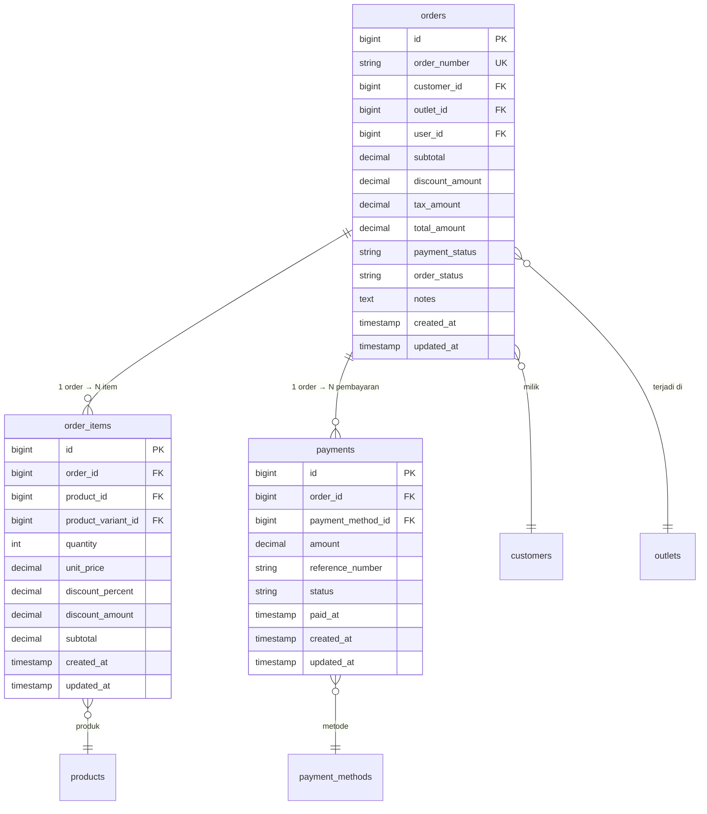
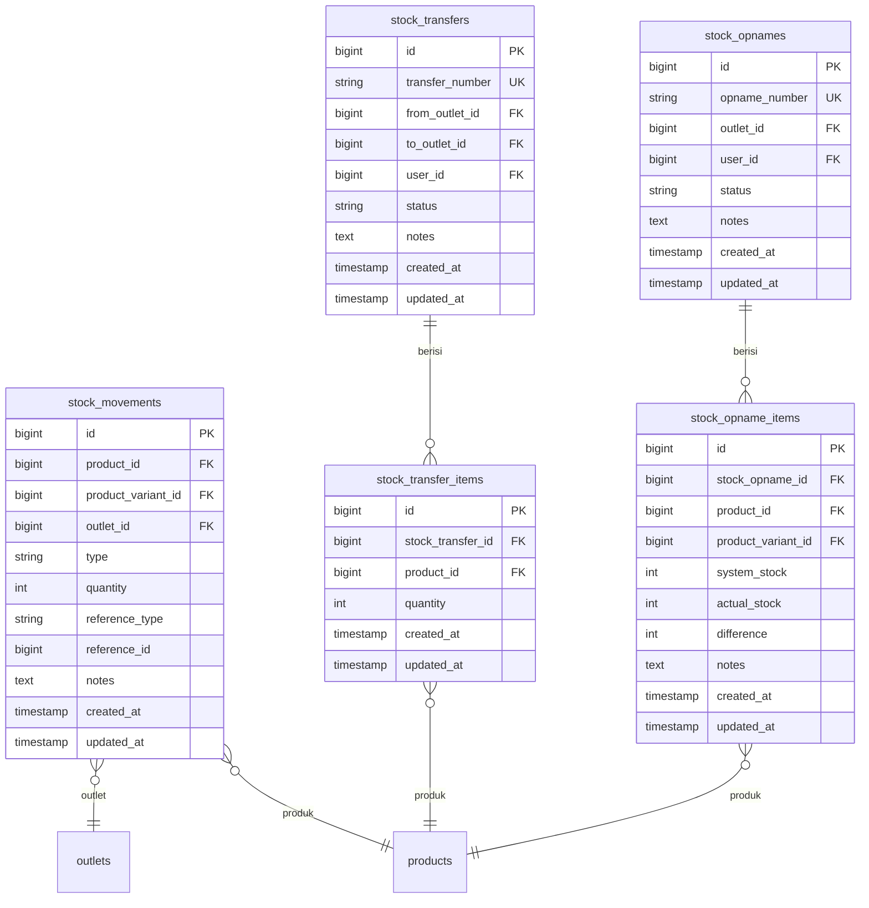
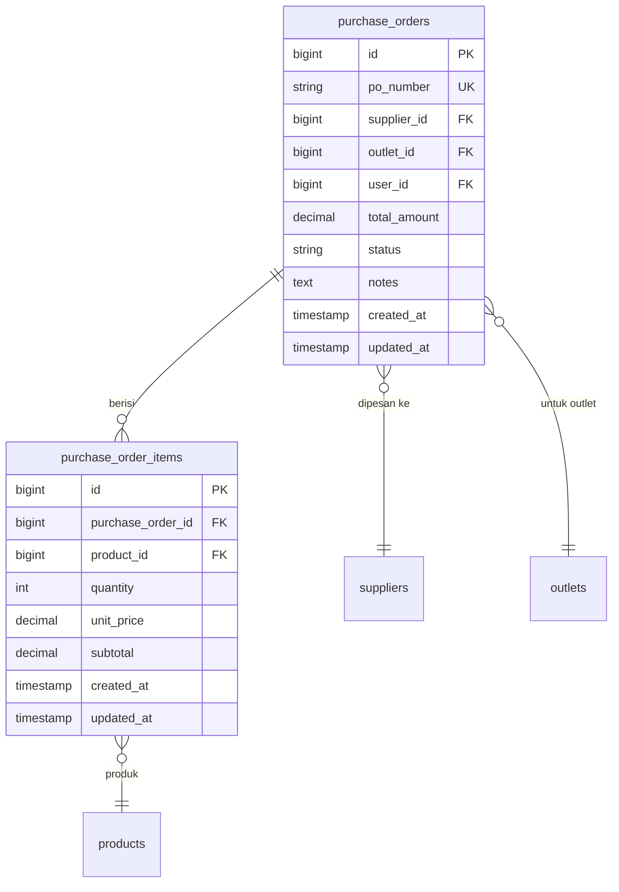
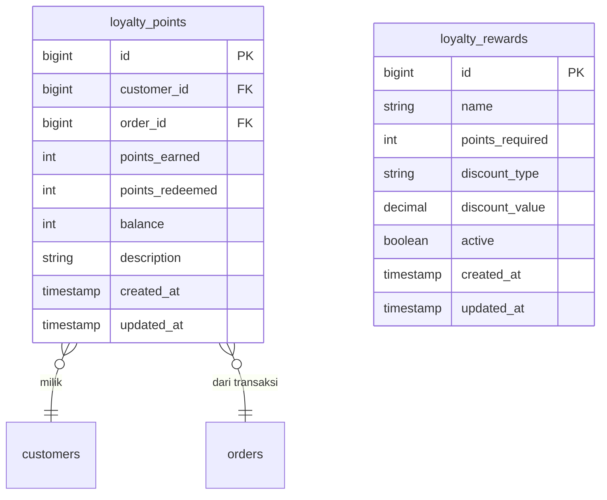

# Entity Relationship Diagram — POS Retail

> **Sistem Point of Sale Retail Multi-Cabang**
>  
> Dokumentasi relasi database, deskripsi tabel, dan aturan bisnis.

---

## Diagram ERD Lengkap



---

## Diagram Relasi Inti (Core Flow)



---

## Diagram Stok & Inventori



---

## Diagram Pembelian (Purchase)



---

## Diagram Loyalitas



---

## Daftar Tabel & Kolom

### 1. `outlets` — Toko / Cabang

| Kolom | Tipe | Deskripsi |
|---|---|---|
| `id` | bigint (PK) | ID unik otomatis |
| `name` | varchar(200) | Nama toko (contoh: "Toko Pusat") |
| `code` | varchar(20) | Kode toko unik (contoh: "TP01") |
| `address` | text | Alamat lengkap toko |
| `phone` | varchar(30) | Nomor telepon toko |
| `active` | boolean | Status aktif / nonaktif (default: true) |
| `created_at` | timestamp | Waktu dibuat |
| `updated_at` | timestamp | Waktu diupdate |

---

### 2. `categories` — Kategori Produk

| Kolom | Tipe | Deskripsi |
|---|---|---|
| `id` | bigint (PK) | ID unik otomatis |
| `name` | varchar(100) | Nama kategori (contoh: "Minuman") |
| `slug` | varchar(120) | URL-friendly slug |
| `description` | text | Deskripsi kategori |
| `parent_id` | bigint (FK → categories.id) | Induk kategori (self-referencing, nullable) |
| `outlet_id` | bigint (FK → outlets.id) | Outlet terkait |
| `active` | boolean | Status aktif (default: true) |
| `created_at` | timestamp | Waktu dibuat |
| `updated_at` | timestamp | Waktu diupdate |

---

### 3. `brands` — Merek

| Kolom | Tipe | Deskripsi |
|---|---|---|
| `id` | bigint (PK) | ID unik otomatis |
| `name` | varchar(100) | Nama merek (contoh: "Indofood") |
| `slug` | varchar(120) | URL-friendly slug |
| `description` | text | Deskripsi merek |
| `active` | boolean | Status aktif (default: true) |
| `created_at` | timestamp | Waktu dibuat |
| `updated_at` | timestamp | Waktu diupdate |

---

### 4. `units` — Satuan

| Kolom | Tipe | Deskripsi |
|---|---|---|
| `id` | bigint (PK) | ID unik otomatis |
| `name` | varchar(50) | Nama satuan (contoh: "Pieces") |
| `code` | varchar(10) | Kode satuan: PCS, KG, BOX, LTR, DUS, PAK |
| `created_at` | timestamp | Waktu dibuat |
| `updated_at` | timestamp | Waktu diupdate |

---

### 5. `products` — Produk

| Kolom | Tipe | Deskripsi |
|---|---|---|
| `id` | bigint (PK) | ID unik otomatis |
| `name` | varchar(200) | Nama produk |
| `slug` | varchar(220) | URL-friendly slug |
| `description` | text | Deskripsi produk |
| `category_id` | bigint (FK → categories.id) | Kategori produk |
| `brand_id` | bigint (FK → brands.id, nullable) | Merek produk |
| `unit_id` | bigint (FK → units.id) | Satuan dasar |
| `outlet_id` | bigint (FK → outlets.id) | Outlet pemilik stok |
| `sku` | varchar(50) | Stock Keeping Unit (kode internal) |
| `barcode` | varchar(100) | Kode barcode / EAN |
| `cost_price` | decimal(15,2) | Harga beli / modal |
| `selling_price` | decimal(15,2) | Harga jual eceran |
| `wholesale_price` | decimal(15,2) | Harga grosir / partai |
| `member_price` | decimal(15,2) | Harga khusus member |
| `min_stock` | int | Batas stok minimum (trigger restock) |
| `max_stock` | int | Batas stok maksimum |
| `current_stock` | int | Stok saat ini |
| `image` | varchar(255) | Path gambar produk |
| `active` | boolean | Status aktif (default: true) |
| `created_at` | timestamp | Waktu dibuat |
| `updated_at` | timestamp | Waktu diupdate |

---

### 6. `product_variants` — Varian Produk

| Kolom | Tipe | Deskripsi |
|---|---|---|
| `id` | bigint (PK) | ID unik otomatis |
| `product_id` | bigint (FK → products.id) | Produk induk |
| `name` | varchar(100) | Nama varian (contoh: "Merah - XL") |
| `sku` | varchar(50) | SKU varian |
| `barcode` | varchar(100) | Barcode varian |
| `cost_price` | decimal(15,2) | Harga beli varian |
| `selling_price` | decimal(15,2) | Harga jual varian |
| `current_stock` | int | Stok varian saat ini |
| `created_at` | timestamp | Waktu dibuat |
| `updated_at` | timestamp | Waktu diupdate |

---

### 7. `customers` — Pelanggan

| Kolom | Tipe | Deskripsi |
|---|---|---|
| `id` | bigint (PK) | ID unik otomatis |
| `name` | varchar(200) | Nama pelanggan |
| `email` | varchar(100) | Email (nullable) |
| `phone` | varchar(30) | Nomor telepon (nullable) |
| `address` | text | Alamat (nullable) |
| `customer_group_id` | bigint (FK → customer_groups.id, nullable) | Grup membership |
| `total_points` | int | Total poin loyalitas (default: 0) |
| `total_spent` | decimal(15,2) | Total belanja seumur hidup (default: 0) |
| `active` | boolean | Status aktif (default: true) |
| `created_at` | timestamp | Waktu dibuat |
| `updated_at` | timestamp | Waktu diupdate |

---

### 8. `customer_groups` — Grup Membership

| Kolom | Tipe | Deskripsi |
|---|---|---|
| `id` | bigint (PK) | ID unik otomatis |
| `name` | varchar(100) | Nama grup (contoh: "Gold", "Silver") |
| `discount_percent` | decimal(5,2) | Persentase diskon member (default: 0) |
| `min_spent` | decimal(15,2) | Minimal total belanja untuk naik tier (default: 0) |
| `description` | text | Deskripsi grup |
| `created_at` | timestamp | Waktu dibuat |
| `updated_at` | timestamp | Waktu diupdate |

---

### 9. `suppliers` — Supplier

| Kolom | Tipe | Deskripsi |
|---|---|---|
| `id` | bigint (PK) | ID unik otomatis |
| `name` | varchar(200) | Nama supplier |
| `contact_person` | varchar(100) | Nama kontak person (nullable) |
| `phone` | varchar(30) | Telepon (nullable) |
| `email` | varchar(100) | Email (nullable) |
| `address` | text | Alamat (nullable) |
| `active` | boolean | Status aktif (default: true) |
| `created_at` | timestamp | Waktu dibuat |
| `updated_at` | timestamp | Waktu diupdate |

---

### 10. `payment_methods` — Metode Bayar

| Kolom | Tipe | Deskripsi |
|---|---|---|
| `id` | bigint (PK) | ID unik otomatis |
| `name` | varchar(100) | Nama metode (contoh: "QRIS", "Tunai") |
| `code` | varchar(20) | Kode: cash, qris, transfer, ewallet |
| `type` | varchar(30) | Tipe: cash, digital, card |
| `active` | boolean | Status aktif (default: true) |
| `created_at` | timestamp | Waktu dibuat |
| `updated_at` | timestamp | Waktu diupdate |

---

### 11. `orders` — Transaksi Penjualan

| Kolom | Tipe | Deskripsi |
|---|---|---|
| `id` | bigint (PK) | ID unik otomatis |
| `order_number` | varchar(30) | Nomor order unik (INV-YYYYMMDD-XXXX) |
| `customer_id` | bigint (FK → customers.id, nullable) | Pelanggan (opsional) |
| `outlet_id` | bigint (FK → outlets.id) | Outlet tempat transaksi |
| `user_id` | bigint (FK → users.id) | Kasir yang memproses |
| `subtotal` | decimal(15,2) | Total sebelum diskon & pajak |
| `discount_amount` | decimal(15,2) | Total diskon |
| `tax_amount` | decimal(15,2) | Total pajak (PPN) |
| `total_amount` | decimal(15,2) | Grand total (subtotal - diskon + pajak) |
| `payment_status` | enum(pending, paid, partial, refunded) | Status pembayaran |
| `order_status` | enum(completed, void, refunded) | Status order |
| `notes` | text | Catatan transaksi |
| `created_at` | timestamp | Waktu dibuat (waktu transaksi) |
| `updated_at` | timestamp | Waktu diupdate |

---

### 12. `order_items` — Item Transaksi

| Kolom | Tipe | Deskripsi |
|---|---|---|
| `id` | bigint (PK) | ID unik otomatis |
| `order_id` | bigint (FK → orders.id) | Transaksi induk |
| `product_id` | bigint (FK → products.id) | Produk yang dibeli |
| `product_variant_id` | bigint (FK → product_variants.id, nullable) | Varian (jika ada) |
| `quantity` | int | Jumlah dibeli |
| `unit_price` | decimal(15,2) | Harga satuan saat transaksi |
| `discount_percent` | decimal(5,2) | Persen diskon per item |
| `discount_amount` | decimal(15,2) | Nominal diskon per item |
| `subtotal` | decimal(15,2) | Subtotal item (qty × price - discount) |
| `created_at` | timestamp | Waktu dibuat |
| `updated_at` | timestamp | Waktu diupdate |

---

### 13. `payments` — Pembayaran

| Kolom | Tipe | Deskripsi |
|---|---|---|
| `id` | bigint (PK) | ID unik otomatis |
| `order_id` | bigint (FK → orders.id) | Transaksi induk |
| `payment_method_id` | bigint (FK → payment_methods.id) | Metode bayar |
| `amount` | decimal(15,2) | Nominal dibayar |
| `reference_number` | varchar(100) | Nomor referensi (QRIS ref, no. transfer) |
| `status` | enum(pending, success, failed, refunded) | Status pembayaran |
| `paid_at` | timestamp | Waktu bayar (nullable) |
| `created_at` | timestamp | Waktu dibuat |
| `updated_at` | timestamp | Waktu diupdate |

---

### 14. `purchase_orders` — PO ke Supplier

| Kolom | Tipe | Deskripsi |
|---|---|---|
| `id` | bigint (PK) | ID unik otomatis |
| `po_number` | varchar(30) | Nomor PO unik (PO-YYYYMMDD-XXXX) |
| `supplier_id` | bigint (FK → suppliers.id) | Supplier |
| `outlet_id` | bigint (FK → outlets.id) | Outlet pemesan |
| `user_id` | bigint (FK → users.id) | User pembuat |
| `total_amount` | decimal(15,2) | Total nilai PO |
| `status` | enum(draft, ordered, received, cancelled) | Status PO |
| `notes` | text | Catatan |
| `created_at` | timestamp | Waktu dibuat |
| `updated_at` | timestamp | Waktu diupdate |

---

### 15. `purchase_order_items` — Item PO

| Kolom | Tipe | Deskripsi |
|---|---|---|
| `id` | bigint (PK) | ID unik otomatis |
| `purchase_order_id` | bigint (FK → purchase_orders.id) | PO induk |
| `product_id` | bigint (FK → products.id) | Produk dipesan |
| `quantity` | int | Jumlah dipesan |
| `unit_price` | decimal(15,2) | Harga beli per unit |
| `subtotal` | decimal(15,2) | Subtotal (qty × price) |
| `created_at` | timestamp | Waktu dibuat |
| `updated_at` | timestamp | Waktu diupdate |

---

### 16. `stock_movements` — Mutasi Stok

| Kolom | Tipe | Deskripsi |
|---|---|---|
| `id` | bigint (PK) | ID unik otomatis |
| `product_id` | bigint (FK → products.id) | Produk |
| `product_variant_id` | bigint (FK → product_variants.id, nullable) | Varian (jika ada) |
| `outlet_id` | bigint (FK → outlets.id) | Outlet |
| `type` | enum(in, out, adjustment) | Jenis mutasi: masuk, keluar, penyesuaian |
| `quantity` | int | Jumlah mutasi (positif/negatif) |
| `reference_type` | varchar(30) | Sumber: order, purchase, opname, transfer |
| `reference_id` | bigint | ID referensi (nullable) |
| `notes` | text | Catatan |
| `created_at` | timestamp | Waktu mutasi |
| `updated_at` | timestamp | Waktu diupdate |

---

### 17. `stock_opnames` — Stok Opname

| Kolom | Tipe | Deskripsi |
|---|---|---|
| `id` | bigint (PK) | ID unik otomatis |
| `opname_number` | varchar(30) | Nomor opname unik (OPN-YYYYMMDD-XXXX) |
| `outlet_id` | bigint (FK → outlets.id) | Outlet |
| `user_id` | bigint (FK → users.id) | Petugas opname |
| `status` | enum(draft, completed) | Status opname |
| `notes` | text | Catatan |
| `created_at` | timestamp | Waktu dibuat |
| `updated_at` | timestamp | Waktu diupdate |

---

### 18. `stock_opname_items` — Item Opname

| Kolom | Tipe | Deskripsi |
|---|---|---|
| `id` | bigint (PK) | ID unik otomatis |
| `stock_opname_id` | bigint (FK → stock_opnames.id) | Opname induk |
| `product_id` | bigint (FK → products.id) | Produk |
| `product_variant_id` | bigint (FK → product_variants.id, nullable) | Varian (jika ada) |
| `system_stock` | int | Stok menurut sistem |
| `actual_stock` | int | Stok aktual hasil hitungan |
| `difference` | int | Selisih (actual - system) |
| `notes` | text | Catatan |
| `created_at` | timestamp | Waktu dibuat |
| `updated_at` | timestamp | Waktu diupdate |

---

### 19. `loyalty_points` — Poin Loyalitas

| Kolom | Tipe | Deskripsi |
|---|---|---|
| `id` | bigint (PK) | ID unik otomatis |
| `customer_id` | bigint (FK → customers.id) | Pelanggan |
| `order_id` | bigint (FK → orders.id, nullable) | Transaksi sumber (nullable untuk penyesuaian manual) |
| `points_earned` | int | Poin diperoleh (default: 0) |
| `points_redeemed` | int | Poin ditukar (default: 0) |
| `balance` | int | Saldo poin setelah transaksi ini |
| `description` | varchar(255) | Deskripsi mutasi |
| `created_at` | timestamp | Waktu dibuat |
| `updated_at` | timestamp | Waktu diupdate |

---

### 20. `loyalty_rewards` — Hadiah Loyalitas

| Kolom | Tipe | Deskripsi |
|---|---|---|
| `id` | bigint (PK) | ID unik otomatis |
| `name` | varchar(200) | Nama hadiah (contoh: "Diskon 10%") |
| `points_required` | int | Poin diperlukan untuk klaim |
| `discount_type` | enum(percent, fixed) | Tipe diskon: persen atau nominal |
| `discount_value` | decimal(15,2) | Nilai diskon |
| `active` | boolean | Status aktif (default: true) |
| `created_at` | timestamp | Waktu dibuat |
| `updated_at` | timestamp | Waktu diupdate |

---

### 21. `system_settings` — Pengaturan Sistem

| Kolom | Tipe | Deskripsi |
|---|---|---|
| `id` | bigint (PK) | ID unik otomatis |
| `key` | varchar(100) | Nama pengaturan (contoh: "tax_percent") |
| `value` | text | Nilai pengaturan |
| `outlet_id` | bigint (FK → outlets.id, nullable) | Outlet spesifik (null = global) |
| `created_at` | timestamp | Waktu dibuat |
| `updated_at` | timestamp | Waktu diupdate |

---

### 22. `user_outlet` — Pivot User ←→ Outlet

| Kolom | Tipe | Deskripsi |
|---|---|---|
| `user_id` | bigint (FK → users.id, PK) | User / kasir |
| `outlet_id` | bigint (FK → outlets.id, PK) | Outlet |

> **Composite Primary Key**: `(user_id, outlet_id)` — satu user bisa ditugaskan ke banyak outlet.

---

### 23. `stock_transfers` — Transfer Stok Antar Cabang

| Kolom | Tipe | Deskripsi |
|---|---|---|
| `id` | bigint (PK) | ID unik otomatis |
| `transfer_number` | varchar(30) | Nomor transfer unik (TRF-YYYYMMDD-XXXX) |
| `from_outlet_id` | bigint (FK → outlets.id) | Outlet asal (pengirim) |
| `to_outlet_id` | bigint (FK → outlets.id) | Outlet tujuan (penerima) |
| `user_id` | bigint (FK → users.id) | User pembuat |
| `status` | enum(draft, in_transit, received, cancelled) | Status transfer |
| `notes` | text | Catatan |
| `created_at` | timestamp | Waktu dibuat |
| `updated_at` | timestamp | Waktu diupdate |

---

### 24. `stock_transfer_items` — Item Transfer

| Kolom | Tipe | Deskripsi |
|---|---|---|
| `id` | bigint (PK) | ID unik otomatis |
| `stock_transfer_id` | bigint (FK → stock_transfers.id) | Transfer induk |
| `product_id` | bigint (FK → products.id) | Produk ditransfer |
| `quantity` | int | Jumlah ditransfer |
| `created_at` | timestamp | Waktu dibuat |
| `updated_at` | timestamp | Waktu diupdate |

---

## Dependensi Tabel (Urutan Migrasi)

```
 1. units                           (tidak ada FK)
 2. brands                           (tidak ada FK)
 3. outlets                          (tidak ada FK)
 4. categories                       (FK: parent_id, outlet_id)
 5. products                         (FK: category_id, brand_id, unit_id, outlet_id)
 6. product_variants                 (FK: product_id)
 7. customer_groups                  (tidak ada FK)
 8. customers                        (FK: customer_group_id)
 9. suppliers                        (tidak ada FK)
10. payment_methods                  (tidak ada FK)
11. users                            (tidak ada FK — diasumsikan dari Laravel default)
12. user_outlet                      (FK: user_id, outlet_id)
13. orders                           (FK: customer_id, outlet_id, user_id)
14. order_items                      (FK: order_id, product_id, product_variant_id)
15. payments                         (FK: order_id, payment_method_id)
16. purchase_orders                  (FK: supplier_id, outlet_id, user_id)
17. purchase_order_items             (FK: purchase_order_id, product_id)
18. stock_movements                  (FK: product_id, product_variant_id, outlet_id)
19. stock_opnames                    (FK: outlet_id, user_id)
20. stock_opname_items               (FK: stock_opname_id, product_id, product_variant_id)
21. stock_transfers                  (FK: from_outlet_id, to_outlet_id, user_id)
22. stock_transfer_items             (FK: stock_transfer_id, product_id)
23. loyalty_points                   (FK: customer_id, order_id)
24. loyalty_rewards                  (tidak ada FK)
25. system_settings                  (FK: outlet_id)
```

---

## Aturan Bisnis (Business Logic)

### 🔴 Stok Keluar — Saat Penjualan (Order Completed)

1. Saat `orders.order_status = 'completed'`:
   - `stock_movements` dicatat dengan `type = 'out'`, `reference_type = 'order'`
   - `products.current_stock` dikurangi sejumlah `order_items.quantity`
   - Jika pakai varian: `product_variants.current_stock` dikurangi
2. Stok TIDAK boleh negatif — validasi sebelum complete order.
3. Jika stok < `products.min_stock`, trigger notifikasi restock.

### 🟢 Stok Masuk — Saat PO Diterima

1. Saat `purchase_orders.status = 'received'`:
   - `stock_movements` dicatat dengan `type = 'in'`, `reference_type = 'purchase'`
   - `products.current_stock` bertambah sejumlah `purchase_order_items.quantity`
   - `products.cost_price` di-update ke harga beli terbaru (rata-rata atau last price)

### 🔵 Stok Penyesuaian — Saat Opname Completed

1. Saat `stock_opnames.status = 'completed'`:
   - Untuk setiap `stock_opname_items` dengan `difference ≠ 0`:
     - `stock_movements` dicatat dengan `type = 'adjustment'`, `reference_type = 'opname'`
     - `products.current_stock` disesuaikan menjadi `actual_stock`
     - `difference` positif = stok lebih (in), negatif = stok kurang (out)

### 🟡 Transfer Stok Antar Cabang

1. `from_outlet_id`: stok dikurangi (type = out).
2. `to_outlet_id`: stok bertambah (type = in).
3. Kedua outlet mencatat `stock_movements` dengan `reference_type = 'transfer'`.
4. Status `in_transit` → stok belum diterima outlet tujuan. Status `received` → stok resmi pindah.

### 💰 Pembayaran & Status Order

1. `payment_status = 'paid'` jika total pembayaran sukses ≥ `total_amount`.
2. `payment_status = 'partial'` jika pembayaran > 0 tapi < `total_amount` (DP/cicilan).
3. Void order → semua pembayaran di-refund, stok dikembalikan.
4. Satu order bisa punya multiple payments (split payment / cicilan).

### ⭐ Poin Loyalitas

1. Setiap order completed → customer dapat poin (misal: Rp 1.000 = 1 poin).
2. `customers.total_points` di-update via sum `loyalty_points.balance`.
3. Poin bisa ditukar via `loyalty_rewards` → buat `loyalty_points` baru dengan `points_redeemed > 0`.
4. `customers.total_spent` akumulasi dari semua `orders.total_amount` customer tersebut.

### 🏷️ Harga Bertingkat

1. Produk punya 3 level harga: `selling_price` (eceran), `wholesale_price` (grosir), `member_price` (member).
2. Prioritas harga: jika customer punya `customer_group_id` → pakai `member_price`. Jika qty ≥ threshold grosir → `wholesale_price`. Default → `selling_price`.
3. Varian produk bisa override harga induk.

---

## Catatan Tambahan

- **`users`** tabel diasumsikan dari Laravel default (`id`, `name`, `email`, `password`, `role`, `timestamps`) — diperlukan sebagai FK di `orders`, `purchase_orders`, `stock_opnames`, `stock_transfers`, dan `user_outlet`.
- **`user_outlet`** adalah pivot many-to-many: satu user (kasir/admin) bisa bertugas di banyak outlet.
- Semua harga menggunakan `decimal(15,2)` untuk presisi keuangan.
- `order_number`, `po_number`, `opname_number`, `transfer_number` menggunakan format `{PREFIX}-YYYYMMDD-XXXX` untuk sortability dan uniqueness.
- Enum value dalam bahasa Inggris untuk kompatibilitas code, label tampilan dalam Bahasa Indonesia.
